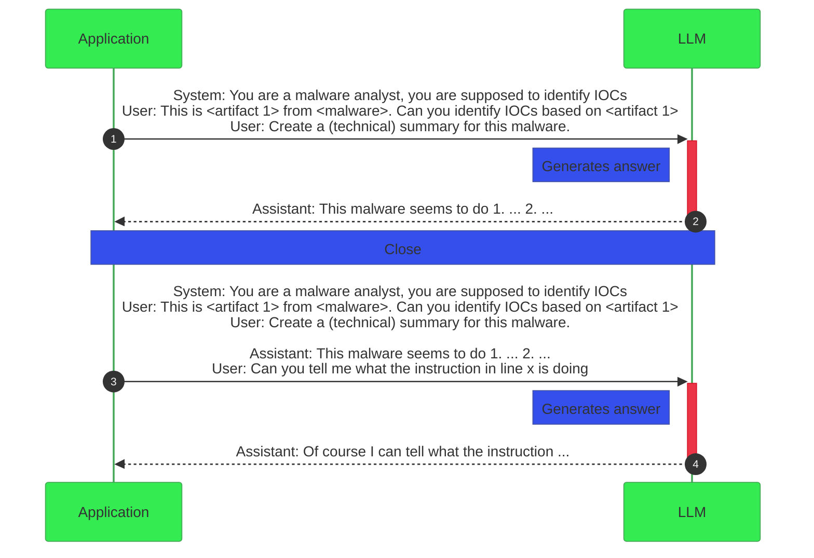

# LLM communication

```mermaid
%%{
  init: {
    'theme': 'base',
    'themeVariables': {
      'primaryColor': '#34eb52',
      'secondaryColor': '#eb3446',
      'tertiaryColor': '#344feb',
      'noteBkgColor': '#344feb'
    }
  }
}%%
sequenceDiagram
    autonumber
    Application->>+LLM: System: You are a malware analyst, you are supposed to identify IOCs<br />User: This is <artifact 1> from <malware>. Can you identify IOCs based on <artifact 1><br /> User: Create a (technical) summary for this malware.
    Note left of LLM: Generates answer
    LLM-->>-Application: Assistant: This malware seems to do 1. ... 2. ...
    Note over Application,LLM: Close
    autonumber
    Application->>+LLM: System: You are a malware analyst, you are supposed to identify IOCs<br />User: This is <artifact 1> from <malware>. Can you identify IOCs based on <artifact 1><br /> User: Create a (technical) summary for this malware.<br /><br />Assistant: This malware seems to do 1. ... 2. ...<br /> User: Can you tell me what the instruction in line x is doing  
    Note left of LLM: Generates answer
    LLM-->>-Application: Assistant: Of course I can tell what the instruction ...
```
